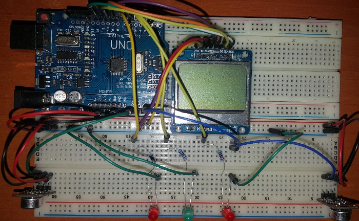

# Digital Signal Processing

- Convolution
- Correlation
- Real DFT-IDFT
- FIR Filter
- Sound Localization

### Basic Sound Localization with Arduino 

**Hardware**

- Arduino Uno
- MAX4466 Module
- Nokia 5110 Lcd

Turkish Documents : dsp_rapor.pdf

